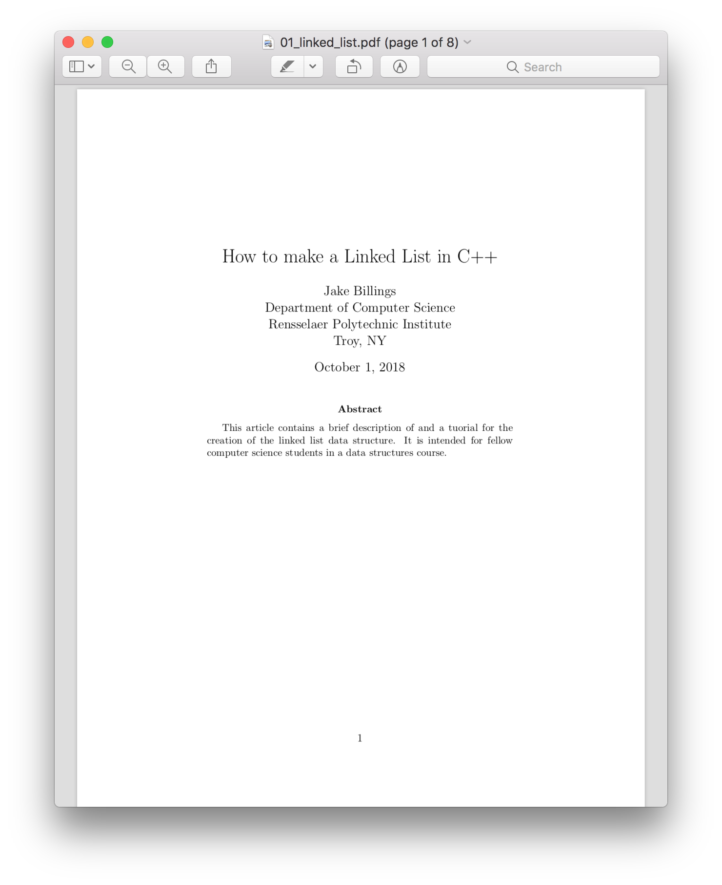

# cs-articles
This repository contains TeX versions of computer science tutorials and articles I have written.

### Articles 
- [How to Make a Linked List in C++](https://github.com/jake-billings/cs-articles/blob/master/01_linked_list/01_linked_list.pdf)

## Other Projects
Checkout my other projects at [https://jakebillings.com](http://www.jakebillings.com) or contact me via [LinkedIn](https://www.linkedin.com/in/jake-billings/).
